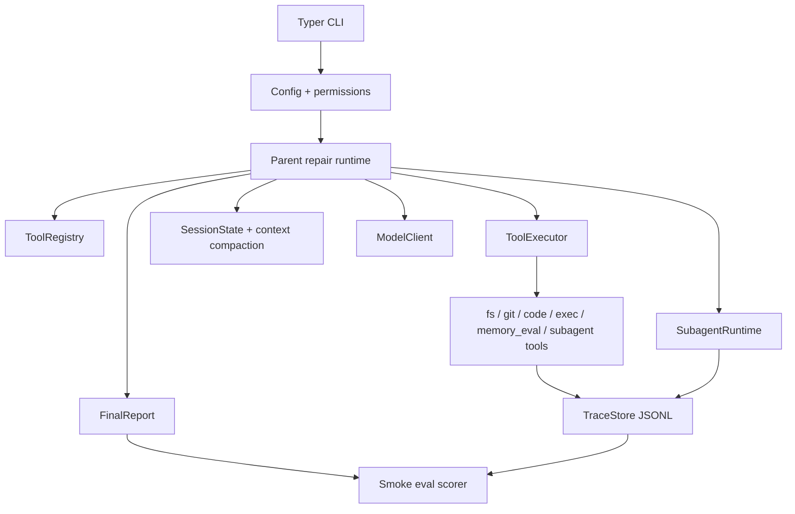

# PatchPilot X-ARC Failing-Test Repair Plan

## Summary

Build PatchPilot into a production-shaped autonomous failing-test repair agent that visibly satisfies the five X-ARC requirements: 50+ typed tools, isolated subagents, a 20+ tool-call repair session, production scaffolding, and composable tool I/O.

---

## Problem Frame

`PRD.md` defines PatchPilot as a Product v1 for autonomous failing-test repair, with the X-ARC assignment as the release gate. The current repository has a useful foundation in `patchpilot/config.py`, `patchpilot/errors.py`, `patchpilot/observability/tracing.py`, `patchpilot/schemas/`, and the first `fs`, `git`, and `code` tool modules. It does not yet have the CLI entrypoint referenced by `pyproject.toml`, the model layer, adapters, runtime, subagents, eval harness, tests, fixtures, or all tool modules expected by `patchpilot/tools/__init__.py`.

The plan prioritizes the shortest credible path to a demonstrable repair loop. The product remains framed as failing-test repair, while general coding work, PR creation, broad stack support, and CI integration stay deferred.

---

## Requirements

**Assignment proof**

- R1. `patchpilot tools list` must show at least 50 registered tools across at least four namespaces, with names, descriptions, schemas, permissions, retry policy, and rate-limit policy.
- R2. Tool execution must resolve through `ToolRegistry` and `ToolExecutor`, not through a giant conditional dispatch path.
- R3. The main repair run must include model-driven tool selection events in trace output before tool execution.
- R4. A fixture repair run must produce at least 20 successful or failed tool call records within one session without losing phase coherence.
- R5. At least one tool must spawn a real subagent that runs in an isolated context with scoped tools and returns a validated structured result to the parent.
- R6. At least one traceable chain must pass structured output from one tool into another tool rather than treating tool calls as isolated terminals.
- R7. The codebase must include observability, retries with exponential backoff, rate limiting, typed errors, unit tests, integration tests, and a deterministic eval harness.

**Failing-test repair behavior**

- R8. `patchpilot run --repo <path> --goal <goal> --allow-exec --allow-write` must inspect a local repo, reproduce a failing test, investigate evidence, plan a patch, validate before writing, apply a bounded patch, rerun tests, review the diff, and emit a final report.
- R9. Python/pytest repos must be first-class: adapter detection, test-command detection, failure-location extraction, targeted command selection, and full validation must work for the fixture path.
- R10. Non-Python or unknown repos must be able to enter the same orchestration when the user supplies `--test-command`, even if repair quality is not equally strong.
- R11. PatchPilot must not write files unless `--allow-write` is enabled and a validated patch plan exists.
- R12. PatchPilot must not execute local commands unless `--allow-exec` is enabled, and high-risk commands must require `--allow-high-risk-exec`.
- R13. Final reports must be JSON-serializable and include status, root cause, task classification, patch plan summary, changed files, attempts, tests run, subagents, risks, and trace ID.

**Submission artifacts**

- R14. `patchpilot eval --suite smoke` must emit JSON that scores the fixture run against the X-ARC properties.
- R15. The test suite must cover registry integrity, schema validation, executor policy, retries, rate limits, command risk classification, context compaction, adapters, subagents, eval scoring, and at least one end-to-end fixture repair.
- R16. `MEMO.md` must summarize what was built, what was cut, what more time would address, and one defended design decision.

---

## Key Technical Decisions

- **Deterministic path first:** Build the repair loop so `FakeModelClient` can drive the fixture and eval deterministically before optimizing live OpenRouter behavior. This makes the submission reliable without hiding the live provider interface.
- **Keep LangGraph as orchestration substrate, not product logic:** Add `langgraph` for stateful phase execution if needed, but keep assignment-critical behavior in PatchPilot-owned runtime, registry, schemas, subagent contracts, traces, and evals. Official LangGraph docs identify it as the stateful workflow package and list `langgraph` as the base Python install.
- **Model-driven within a fixed lifecycle:** Preserve the lifecycle from `PRD.md` but require each phase to expose allowed tools and record a `model.tool_selection` event. The lifecycle provides coherence; the model still chooses from registry metadata.
- **Subagents share runtime, not transcript:** Implement one `SubagentRuntime` that accepts typed configs for diagnosis and review. Each subagent receives task-specific evidence and scoped tools, never the full parent state.
- **Patch plans are the write gate:** Represent patch intent as structured state before any file mutation. `code.validate_patch_shape` and executor permission checks are the hard boundary before write-capable tools.
- **Eval reads traces, not internal objects:** The smoke eval should score persisted trace and report artifacts so the reviewer can audit the same proof the product emits.
- **Thin adapters over stack-specific core logic:** Keep the parent loop language-agnostic and let adapters provide detection, failure parsing, and validation commands. Python/pytest gets depth; generic command support gets breadth.

---

## High-Level Technical Design

The parent runtime owns phase order and state. The model client selects tools from filtered registry metadata. The executor validates permissions, schemas, retries, rate limits, and traces each call. Subagents run smaller scoped loops and return structured results. The eval harness reads trace/report artifacts to prove the assignment properties.

---

## Implementation Units

### U1. CLI, Registry Integrity, And Project Bootstrap

- **Goal:** Make the package runnable and make the existing registry path coherent.
- **Files:** `patchpilot/cli.py`, `patchpilot/tools/__init__.py`, `patchpilot/tools/registry.py`, `patchpilot/tools/executor.py`, `patchpilot/config.py`, `tests/test_cli.py`, `tests/test_registry.py`, `tests/test_executor.py`
- **Existing patterns:** Keep the decorator-based `ToolRegistry` in `patchpilot/tools/registry.py`; extend `ToolExecutor` rather than replacing it.
- **Work:**
  - Add the missing Typer CLI entrypoint for `patchpilot run`, `patchpilot tools list`, `patchpilot trace show`, and `patchpilot eval`.
  - Fix `patchpilot/tools/__init__.py` by adding the missing modules it imports or narrowing imports only if the module is intentionally deferred.
  - Ensure registry listing serializes tool names, namespace, permission, schema names, retry policy, and rate-limit policy.
  - Align executor trace writes with the `TraceEvent` schema so duration and status land in stable top-level fields, with detailed inputs/errors in payload.
  - Add command-line permission flags and config wiring for repo path, goal, test command, write/exec/high-risk flags, model choice, and trace directory.
  - Add registry integrity tests for duplicate names, namespace prefixes, handler presence, schema presence, 50+ count, and 4+ namespace count.
- **Test scenarios:**
  - `tests/test_cli.py` verifies `patchpilot tools list` returns grouped tool metadata.
  - `tests/test_registry.py` verifies duplicate registration fails and namespace prefixes are enforced.
  - `tests/test_registry.py` verifies the final registry has at least 50 tools and at least four namespaces.
  - `tests/test_executor.py` verifies write tools fail without `allow_write` and exec tools fail without `allow_exec`.
- **Verification:** CLI commands import without errors, especially the currently broken registry import path.

### U2. Complete Tool Namespaces And Command Safety

- **Goal:** Implement the missing `exec`, `memory_eval`, and `subagent` tool modules plus enough concrete handlers to make the 62-tool inventory real.
- **Files:** `patchpilot/tools/exec_tools.py`, `patchpilot/tools/memory_eval.py`, `patchpilot/tools/subagent.py`, `patchpilot/tools/helpers.py`, `patchpilot/schemas/tool_io.py`, `patchpilot/schemas/common.py`, `tests/test_exec_tools.py`, `tests/test_memory_eval_tools.py`, `tests/test_subagent_tools.py`
- **Existing patterns:** Reuse `repo_path`, `run_process`, `detect_test_command`, and existing Pydantic schemas where possible.
- **Work:**
  - Implement exec tools for command running, tests, targeted tests, command existence, test-command detection, command history, environment capture, timeout probing, and safe stubs for formatter/linter/typecheck where commands are unavailable.
  - Add command risk classification and enforce high-risk policy in helper or executor paths.
  - Implement memory tools that record observations, summarize context, retrieve artifacts, and record decisions in `ToolContext.artifacts`.
  - Implement eval tools for loading fixture metadata, scoring run artifacts, asserting trace properties, comparing expected files, and exporting sessions.
  - Implement subagent tools that call `SubagentRuntime` when available and return structured subagent results.
  - Ensure tool outputs are structured Pydantic objects and JSON-serializable.
- **Test scenarios:**
  - `tests/test_exec_tools.py` verifies low-risk test commands run when allowed and high-risk commands are blocked without `allow_high_risk_exec`.
  - `tests/test_exec_tools.py` verifies command output includes stdout, stderr, exit code, duration, and risk.
  - `tests/test_memory_eval_tools.py` verifies observations and decisions are stored and retrieved through structured artifacts.
  - `tests/test_subagent_tools.py` verifies subagent tool calls route to a fake subagent runtime and validate result shape.
- **Verification:** `patchpilot tools list` reaches the required count with executable handlers, not placeholder names only.

### U3. Model Clients And Tool Selection Contract

- **Goal:** Add live and fake model clients that return structured tool-selection decisions and support traced, retryable model calls.
- **Files:** `patchpilot/models/base.py`, `patchpilot/models/openrouter.py`, `patchpilot/models/fake.py`, `patchpilot/runtime/tool_selection.py`, `patchpilot/schemas/tool_io.py`, `tests/test_model_clients.py`, `tests/test_tool_selection.py`
- **Existing patterns:** Use `PatchPilotConfig` for OpenRouter settings and `TraceStore` for model events.
- **Work:**
  - Define a model client interface for structured responses, including selected tool name, arguments, rationale, and finish/report signal.
  - Implement `OpenRouterModelClient` behind the interface using configurable model and base URL.
  - Implement `FakeModelClient` scripts for the fixture repair path and eval runs.
  - Add retry, rate-limit, and typed error handling around model calls.
  - Convert registry phase views into model-readable tool metadata without leaking full internal state.
  - Record `model.called` and `model.tool_selection` events.
- **Test scenarios:**
  - `tests/test_model_clients.py` verifies fake model scripts produce deterministic structured selections.
  - `tests/test_model_clients.py` verifies model errors are typed and traced.
  - `tests/test_tool_selection.py` verifies selected tools resolve through `ToolRegistry`.
  - `tests/test_tool_selection.py` verifies invalid selections create typed errors and trace events.
- **Verification:** The repair runtime can run with `FakeModelClient` without live model access.

### U4. Runtime State, Context Compaction, And Phase Graph

- **Goal:** Build the parent repair runtime with explicit state, phase transitions, plan updates, budgets, and compaction.
- **Files:** `patchpilot/runtime/state.py`, `patchpilot/runtime/context.py`, `patchpilot/runtime/graph.py`, `patchpilot/runtime/__init__.py`, `tests/test_state.py`, `tests/test_context.py`, `tests/test_runtime_phases.py`
- **Existing patterns:** Reuse schemas from `patchpilot/schemas/reports.py` and trace events from `patchpilot/observability/tracing.py`.
- **Work:**
  - Define `SessionState` with goal, plan, current step, observations, tool call history, artifacts, subagent results, memory summary, budgets, and final report.
  - Implement phase order: inspect, reproduce, diagnose, plan_patch, apply_patch, validate, review, report.
  - Emit `plan.updated` events at phase boundaries.
  - Implement compaction after inspect, reproduce, diagnose, validate, and review, plus budget-triggered compaction.
  - Preserve structured artifacts exactly while summarizing older observations and keeping recent tool calls verbatim.
  - Track max tool calls, model calls, repair attempts, and diff lines.
- **Test scenarios:**
  - `tests/test_state.py` verifies state initializes from CLI inputs and config budgets.
  - `tests/test_context.py` verifies compaction preserves `TestResult`, `DiagnosisResult`, `PatchPlan`, `PatchValidation`, `PatchApplyResult`, `ReviewResult`, final diff, open risks, and current plan.
  - `tests/test_runtime_phases.py` verifies phase order and `plan.updated` trace events.
  - `tests/test_runtime_phases.py` verifies budget exhaustion returns `partial` or `failed` rather than looping.
- **Verification:** Runtime state can survive 20+ tool calls with coherent current phase and plan.

### U5. Stack Adapters And Fixture Repositories

- **Goal:** Add adapter logic and fixtures that make the failing-test repair path concrete and deterministic.
- **Files:** `patchpilot/adapters/base.py`, `patchpilot/adapters/python_pytest.py`, `patchpilot/adapters/generic_command.py`, `patchpilot/adapters/__init__.py`, `fixtures/buggy-python-repo/`, `fixtures/generic-command-repo/`, `tests/test_adapters.py`, `tests/fixtures/`
- **Existing patterns:** Reuse `detect_test_command` from `patchpilot/tools/helpers.py` as a starting point, but move stack-specific logic behind adapter interfaces.
- **Work:**
  - Define adapter interface for applies-to detection, package/test config detection, targeted and full command proposal, failure parsing, and test-to-source mapping.
  - Implement `PythonPytestAdapter` with pytest command detection, common failure-location parsing, and targeted test command selection.
  - Implement `GenericCommandAdapter` for user-supplied test commands.
  - Create a minimal buggy Python fixture with one failing test and an obvious source fix.
  - Create a generic-command fixture that proves unknown stacks can enter the flow when a command is supplied.
- **Test scenarios:**
  - `tests/test_adapters.py` verifies Python/pytest detection from `pyproject.toml`, `pytest.ini`, or test layout.
  - `tests/test_adapters.py` verifies targeted command selection for a failed pytest file.
  - `tests/test_adapters.py` verifies generic command adapter activates only when a command is supplied.
  - Fixture tests verify the buggy repo fails before repair and passes after the expected patch.
- **Verification:** The fixture path gives the runtime real failure output and a deterministic repair target.

### U6. Subagent Runtime, DiagnosisAgent, And ReviewAgent

- **Goal:** Implement real isolated subagent loops that satisfy the subagent orchestration requirement.
- **Files:** `patchpilot/runtime/subagents.py`, `patchpilot/schemas/reports.py`, `patchpilot/schemas/tool_io.py`, `patchpilot/tools/subagent.py`, `tests/test_subagents.py`, `tests/test_subagent_integration.py`
- **Existing patterns:** Use `ToolRegistry.phase_view` for scoped tool sets and `ToolExecutor` for execution.
- **Work:**
  - Define typed `SubagentConfig`, subagent input schemas, `DiagnosisResult`, and `ReviewResult`.
  - Implement `SubagentRuntime` that creates isolated context with scoped tools, separate tool history, separate budgets, and child trace spans.
  - Implement `DiagnosisAgent` with read/search/test-output tools only.
  - Implement `ReviewAgent` with diff/read/test-result tools only.
  - Ensure subagent result validation fails with `SubagentError` when malformed.
  - Make parent runtime consume diagnosis and review results as structured artifacts.
- **Test scenarios:**
  - `tests/test_subagents.py` verifies subagents cannot access write tools by default.
  - `tests/test_subagents.py` verifies diagnosis output validates and includes root cause, evidence, recommendation, and confidence.
  - `tests/test_subagents.py` verifies review output validates and can approve or flag issues.
  - `tests/test_subagent_integration.py` verifies parent traces include subagent start, subagent tool calls, subagent completion, and return to parent.
- **Verification:** A function call relabelled as a subagent is avoided; subagents perform their own scoped tool/model loop.

### U7. Patch Planning, Repair Loop, And Final Report

- **Goal:** Connect tool selection, adapters, subagents, patch planning, validation, repair attempts, and reporting into one end-to-end run.
- **Files:** `patchpilot/runtime/graph.py`, `patchpilot/runtime/state.py`, `patchpilot/schemas/reports.py`, `patchpilot/schemas/tool_io.py`, `patchpilot/tools/code.py`, `patchpilot/tools/fs.py`, `tests/test_repair_loop.py`, `tests/integration/test_fixture_repair.py`
- **Existing patterns:** Extend `PatchValidationInput` and `FinalReport` rather than inventing parallel untyped dicts.
- **Work:**
  - Define structured `PatchPlan`, `PatchEdit`, `PatchValidation`, and `PatchApplyResult` schemas.
  - Make diagnosis feed patch-plan generation.
  - Enforce `PatchPlan -> code.validate_patch_shape -> fs.apply_patch`.
  - Classify tasks as `source_fix`, `test_repair`, `config_fix`, `dependency_fix`, `mixed`, or `unsupported`.
  - Track repair attempts and inspect new failure output before retrying.
  - Run targeted validation first and broad validation after targeted success.
  - Capture final diff and summarize changed files with justifications.
  - Emit final JSON-serializable `FinalReport`.
- **Test scenarios:**
  - `tests/test_repair_loop.py` verifies no write tool can run before a valid patch plan.
  - `tests/test_repair_loop.py` verifies failed targeted validation triggers a new inspect step before another patch.
  - `tests/test_repair_loop.py` verifies unsupported classification stops with `failed` or `partial`.
  - `tests/integration/test_fixture_repair.py` verifies fixture repair passes targeted and full validation and emits the expected final report fields.
- **Verification:** The fixture run demonstrates the full product loop, not just separate components.

### U8. Evaluation Harness, Documentation, And Submission Proof

- **Goal:** Make the assignment proof visible through tests, eval output, trace files, and documentation.
- **Files:** `patchpilot/evals/harness.py`, `patchpilot/evals/suites.py`, `patchpilot/evals/__init__.py`, `MEMO.md`, `README.md`, `tests/test_eval_harness.py`, `tests/integration/test_smoke_eval.py`
- **Existing patterns:** Use `TraceStore.read` and `FinalReport` schemas as eval inputs.
- **Work:**
  - Implement `patchpilot eval --suite smoke` to run or score the fixture repair with `FakeModelClient`.
  - Score trace properties: 20+ tool calls, subagent invocation, plan updates, phase order, successful validation, composed tool chain, authorized tools only, and final report completeness.
  - Emit eval JSON suitable for submission.
  - Update README with setup, CLI usage, fixture demo, eval command, trace location, and honest v1 scope.
  - Write one-page `MEMO.md` covering what was built, what was cut, future work, and the defended LangGraph/custom-runtime decision.
  - Add documentation pointers for trace export and video walkthrough.
- **Test scenarios:**
  - `tests/test_eval_harness.py` verifies each eval check passes/fails on synthetic traces.
  - `tests/integration/test_smoke_eval.py` verifies the smoke suite returns passing JSON after a fixture repair.
  - README/MEMO smoke checks verify referenced commands and files exist.
- **Verification:** The repo contains the artifacts X-ARC asked to read: code, tests, eval output path, traces, and `MEMO.md`.

---

## Acceptance Examples

- AE1. **Covers R1, R2.** Given the full registry is built, when `patchpilot tools list` runs, then at least 50 tools appear across at least four namespaces and every listed tool has schema and permission metadata.
- AE2. **Covers R4, R7, R14.** Given the smoke fixture, when `patchpilot eval --suite smoke` runs with `FakeModelClient`, then the eval JSON reports 20+ tool calls, coherent phase order, at least one subagent, a composed tool chain, and passing post-repair validation.
- AE3. **Covers R5.** Given a reproduced pytest failure, when the parent enters diagnosis, then `subagent.spawn_diagnosis` creates an isolated subagent context with read-only scoped tools and returns a validated diagnosis result.
- AE4. **Covers R11, R12.** Given write or exec flags are missing, when the runtime attempts a write or command tool, then the executor blocks the call with a typed policy error and records a failed trace event.
- AE5. **Covers R13.** Given a completed repair attempt, when the run exits, then the final report includes status, root cause, task classification, changed files, attempts, tests run, subagents, risks, and trace ID.

---

## Scope Boundaries

**In scope for this plan**

- Python/pytest fixture repair as the primary demo and eval target.
- Generic command path for non-Python or unknown repos when a command is supplied.
- OpenRouter live client interface plus deterministic fake-model path.
- Tool registry, executor, runtime, subagents, evals, traces, tests, README, and `MEMO.md`.

**Deferred for later**

- Hosted CI integration.
- Pull request creation.
- Deep Node, Go, or additional stack adapters.
- Rich sandboxing beyond repo-bound path checks, command risk classification, flags, budgets, and timeouts.
- Multi-repo memory and long-term knowledge stores.
- Branch-review and repo-maintenance queue product modes.

**Outside this product identity for v1**

- General-purpose feature implementation.
- Forking or repackaging existing coding-agent frameworks as the core implementation.
- Treating trace/eval artifacts as optional demo extras.

---

## System-Wide Impact

This plan affects the whole package surface. The CLI, registry, executor, schemas, trace store, runtime, adapters, model clients, tools, tests, fixtures, and documentation all become connected through the fixture repair path. The most important system-wide invariant is that assignment proof should come from persisted runtime artifacts, not from comments or isolated unit tests.

---

## Risks And Dependencies

- **Risk: The deterministic fake path becomes scripted theater.** Mitigate by still resolving every step through registry metadata, executor validation, traces, schemas, subagent runtime, and eval checks.
- **Risk: Tool count crowds out tool coherence.** Mitigate with registry tests, executable handlers, namespace grouping, and at least one composed chain used by the repair loop.
- **Risk: Subagents collapse into helper functions.** Mitigate with isolated `ToolContext`, scoped registry views, child trace spans, and independent model/tool loops.
- **Risk: LangGraph dependency slows implementation.** Mitigate by keeping graph usage thin; if direct async orchestration is enough for v1, preserve the same runtime contracts and defer deeper graph features.
- **Risk: Live OpenRouter behavior is flaky during demo.** Mitigate by making fake-model eval the release gate and live model runs optional proof.
- **Dependency: LangGraph package.** If graph orchestration is used, add `langgraph` to `pyproject.toml`; official docs list `pip install -U langgraph` for the base Python package.

---

## Sources And Research

- `PRD.md` is the source of truth for product scope, requirements, tool inventory, structured outputs, safety policy, success metrics, and milestones.
- `PRODUCT.md` confirms the earlier product brief and the assignment-fit framing.
- Existing code reviewed: `patchpilot/config.py`, `patchpilot/errors.py`, `patchpilot/observability/tracing.py`, `patchpilot/schemas/common.py`, `patchpilot/schemas/tool_io.py`, `patchpilot/schemas/reports.py`, `patchpilot/tools/registry.py`, `patchpilot/tools/executor.py`, `patchpilot/tools/fs.py`, `patchpilot/tools/git.py`, `patchpilot/tools/code.py`, `patchpilot/tools/helpers.py`, `patchpilot/tools/__init__.py`.
- Official LangGraph overview docs: https://docs.langchain.com/oss/python/langgraph/overview
- Official LangGraph install docs: https://docs.langchain.com/oss/python/langgraph/install
