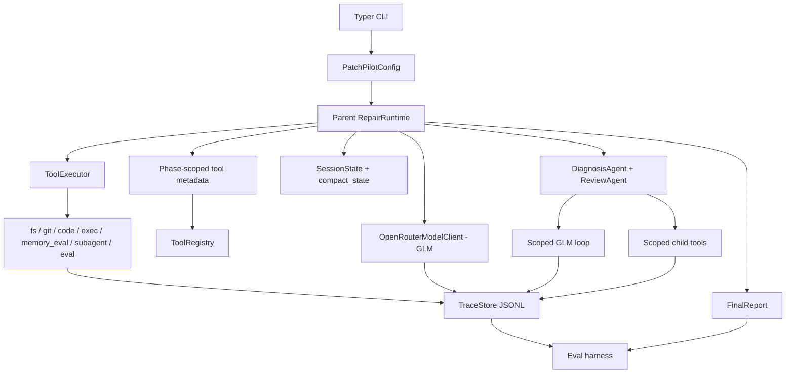

# PatchPilot V1 Real Model Repair Plan

## Summary

Turn PatchPilot from a deterministic v0 proof into a real OpenRouter/GLM-driven Python/pytest repair agent. The v1 product and eval paths should use GLM-4.7 Flash for model decisions, while fake model clients remain only as automated test doubles.

The release should still prove the assignment properties directly from runtime traces: 50+ typed tools, model-driven selection, isolated subagents, 20+ coherent tool calls, production scaffolding, and composable tool I/O.

---

## Problem Frame

`assignment.md` is the final source of truth. It asks for a production-shaped autonomous agent where depth matters more than completion, and it specifically checks architecture, orchestration, context strategy, scaffolding, and composable tools. The current v0 code already has the right skeleton: `ToolRegistry`, `ToolExecutor`, trace storage, safety gates, phased repair runtime, basic OpenRouter provider, fake model scripts, eval scoring, and a smoke fixture.

The gap is that v0 is still strongest as a scripted proof. v1 should make the normal product run real: GLM selects tools, subagents run their own model/tool loops, patch plans are derived from observed evidence, validation failure can cause a retry, and final reports include model/cost/cache metadata. The deterministic path stays, but only to keep tests repeatable and cheap.

---

## Requirements

**Real Model Execution**

- R1. Normal product runs use OpenRouter with GLM-4.7 Flash as the default real model path.
- R2. Fake or mocked model clients are retained only for automated tests; eval runs use the real OpenRouter/GLM path.
- R3. Model responses are structured and validated before use; invalid output produces typed errors and trace events.
- R4. Model calls are traced with model name, phase, status, duration, retry metadata, token usage when available, estimated cost when available, and cache metadata when available.
- R5. Prompt caching support is configurable, and traces expose observed cache behavior without promising savings when provider metadata is absent.

**Repair Capability**

- R6. PatchPilot repairs multiple Python/pytest fixture failures with different failure shapes, not only one calculator-style bug.
- R7. The parent agent can inspect failure output, map tests to source, choose relevant files, and produce bounded patch plans from evidence.
- R8. Patch plans are validated before writes and refused when they escape repo boundaries, exceed limits, or touch protected paths.
- R9. Failed validation triggers a new model decision for additional evidence or retry planning rather than blind reapplication.
- R10. Final reports include changed files, tests run, attempts, root cause, risks, subagents, model used, token/cost/cache metadata, and trace ID.

**Assignment Proof**

- R11. The registry exposes at least 50 typed tools across at least 4 namespaces, and model-selected execution resolves through registry/executor paths.
- R12. The parent run includes at least 20 tool calls in one coherent repair session.
- R13. At least one tool spawns a real isolated subagent that runs its own scoped model/tool loop and returns a typed result to the parent.
- R14. Context management is expressed in code through state, phase views, compaction, summaries, budgets, and artifact preservation.
- R15. At least one repair chain composes structured output from one tool into a later tool or model decision.

**Production Scaffolding**

- R16. External model calls use retry with exponential backoff and rate limiting.
- R17. Local command execution remains permission-gated, timeout-bounded, risk-classified, and traceable.
- R18. Trace files persist model calls, tool calls, subagent spans, phase updates, errors, retries, rate-limit waits, compaction events, and final reports.
- R19. Unit and integration tests cover registry integrity, model response validation, executor policy, command risk, patch safety, runtime failure handling, subagents, eval scoring, deterministic fixture repair, and live-eval contracts.

**Submission Readiness**

- R20. `MEMO.md` is updated for final submission and explains what was built, what was cut, what additional time would address, and one defended design decision.
- R21. The repository can be made public without leaking API keys, local secrets, or unnecessary host-specific paths.
- R22. The walkthrough can demonstrate a real GLM-driven run, one substantive code path, and one moment where user/model direction diverged.
- R23. The submitted artifacts include Codex session export plus PatchPilot runtime traces for demo and eval runs.

---

## Key Technical Decisions

- **Real model is the product and eval default:** `patchpilot run` and `patchpilot eval` should use the OpenRouter provider unless an automated test injects a fake client. This aligns the product with the final assignment instead of the v0 proof path.
- **Fake model stays as test infrastructure:** Deterministic model scripts are still necessary because CI-style tests should not depend on paid, nondeterministic, network-bound calls.
- **Python/pytest is the depth wedge:** v1 should make strong claims for Python/pytest repair and keep generic-command support as a compatibility path, not a competing product claim.
- **Phase lifecycle remains explicit:** The runtime keeps inspect, reproduce, diagnose, plan_patch, apply_patch, validate, review, and report phases. The model chooses tools within phase-scoped registry views; the phase structure preserves long-horizon coherence.
- **Patch plan is the write gate:** The only acceptable write path is evidence -> typed patch plan -> patch-shape validation -> `fs.apply_patch`. This makes safety visible in code and traces.
- **Subagents are child loops, not helper calls:** Diagnosis and review subagents get isolated contexts, scoped tools, independent budgets, model calls, child trace spans, and typed return schemas.
- **Eval scores persisted artifacts:** Assignment proof should come from trace/report files so a reviewer can audit the same evidence the product emits.
- **Prompt caching is observed, not assumed:** v1 should enable provider options when supported and record cache metadata if returned, but avoid hard claims if OpenRouter or the chosen route does not expose it.

---

## High-Level Technical Design

The parent runtime owns phase order, permissions, budgets, and final reporting. GLM receives compact state and phase-scoped tool metadata, then returns a structured tool selection. The executor validates inputs, permissions, retries, rate limits, traces execution, and validates outputs. Subagents run separate child loops and return typed evidence to the parent. The eval harness reads persisted traces and final reports to score the assignment properties.

---

## Implementation Units

### U1. OpenRouter GLM Provider And Model Metadata

- **Goal:** Make OpenRouter/GLM the reliable product model path with typed errors, retries, rate limiting, and cost/cache visibility.
- **Files:** `patchpilot/config.py`, `patchpilot/cli.py`, `patchpilot/models/base.py`, `patchpilot/models/openrouter.py`, `patchpilot/observability/tracing.py`, `patchpilot/schemas/reports.py`, `tests/test_model_clients.py`, `tests/test_cli.py`
- **Work:**
  - Change product and eval default model provider to OpenRouter while preserving fake selection only for automated tests.
  - Set the default model from config/env to the GLM-4.7 Flash OpenRouter model ID.
  - Add model-call retry with exponential backoff and rate limiting around external calls.
  - Add typed model errors for missing API key, request failure, invalid JSON, invalid schema, unsupported finish state, and budget exhaustion.
  - Extend `ToolSelection` or adjacent schemas with optional model metadata: provider, model, input tokens, output tokens, total tokens, estimated cost, cache hit/read/write details when available, and raw provider IDs safe for traces.
  - Trace `model.started`, `model.completed`, `model.failed`, and `model.tool_selection` events.
  - Add CLI flags and env handling for provider, model, base URL, model-call budget, cache preference, and live-eval opt-in.
- **Tests:**
  - Mock HTTP responses validate successful structured selection and metadata extraction.
  - Invalid/malformed responses raise typed errors and write failed trace events.
  - Missing API key fails before making a network call.
  - Fake provider can still be selected explicitly for deterministic tests.
- **Requirements:** R1, R2, R3, R4, R5, R16.

### U2. Parent Runtime Prompting, Phase Control, And Retry Decisions

- **Goal:** Convert the parent repair loop from script-compatible orchestration into a real GLM-driven loop that still preserves phase coherence.
- **Files:** `patchpilot/runtime/graph.py`, `patchpilot/runtime/state.py`, `patchpilot/runtime/context.py`, `patchpilot/models/base.py`, `patchpilot/schemas/tool_io.py`, `patchpilot/schemas/reports.py`, `tests/test_runtime_phases.py`, `tests/test_repair_loop.py`
- **Work:**
  - Build a parent prompt payload from compact state, current phase, recent tool history, preserved artifacts, open risks, and allowed tool metadata.
  - Ensure each model-selected tool is authorized for the current phase before execution.
  - Track attempt number, validation state, previous patch failures, and next action in `SessionState`.
  - On failed targeted or full validation, route back to diagnosis or patch planning based on model decision and current evidence.
  - Persist compaction events and make compaction preserve load-bearing artifacts such as failure output, diagnosis result, patch plan, patch validation, applied patch, test results, review result, and final diff.
  - Make runtime termination explicit: success, partial, failed, or budget_exhausted.
- **Tests:**
  - Runtime rejects model-selected tools that are outside the current phase view.
  - Failed validation creates a new model decision instead of immediately reapplying the same patch.
  - Compaction keeps structured artifacts while shortening old history.
  - Budget exhaustion produces a JSON-serializable failed or partial report.
- **Requirements:** R7, R9, R10, R12, R14, R15, R18.

### U3. Typed Patch Plan And Write Safety Chain

- **Goal:** Make patch application depend on evidence and typed validation, not a hardcoded diff.
- **Files:** `patchpilot/schemas/tool_io.py`, `patchpilot/tools/code.py`, `patchpilot/tools/fs.py`, `patchpilot/tools/helpers.py`, `patchpilot/runtime/graph.py`, `tests/test_fs_tools.py`, `tests/test_repair_loop.py`
- **Work:**
  - Strengthen `PatchPlan` with task classification, root cause, evidence references, expected changed files, edit operations, risk notes, and validation expectations.
  - Add or harden patch validation for repo containment, protected paths, max diff lines, binary files, suspicious test-only fixes, and changed-file consistency.
  - Ensure `fs.apply_patch` only applies unified diffs that remain inside the repo root.
  - Add structured `PatchApplyResult` with changed files, hunks applied, and summary.
  - Feed patch validation output into the model context before write execution.
  - Ensure final changed-file report is derived from `git.diff` plus patch artifacts, not only model prose.
- **Tests:**
  - Patch attempts outside the repo are rejected.
  - Protected path edits are rejected.
  - Diff-size limits are enforced.
  - Valid fixture patches produce changed-file reports with justifications.
- **Requirements:** R7, R8, R10, R15, R17.

### U4. Real Diagnosis And Review Subagents

- **Goal:** Replace canned subagent behavior with isolated scoped model/tool loops.
- **Files:** `patchpilot/runtime/subagents.py`, `patchpilot/tools/subagent.py`, `patchpilot/schemas/tool_io.py`, `patchpilot/schemas/reports.py`, `patchpilot/tools/registry.py`, `tests/test_subagents.py`, `tests/test_subagent_tools.py`, `tests/integration/test_fixture_repair.py`
- **Work:**
  - Define `SubagentConfig` with kind, allowed tools, max model calls, max tool calls, context payload, and output schema.
  - Implement diagnosis subagent with read/search/failure-analysis tools and no write tools.
  - Implement review subagent with diff/read/test-result tools and no write tools.
  - Give each subagent a child `ToolContext`, child session ID, scoped artifacts, scoped registry view, and independent model budget.
  - Return typed diagnosis fields: root cause, evidence, implicated files, recommended patch direction, confidence, risks.
  - Return typed review fields: approved, issues, evidence, regression risk, missing validation, confidence.
  - Record child model calls and child tool calls in trace output.
  - Make parent consume subagent results as structured artifacts for patch planning and final reporting.
- **Tests:**
  - Subagents cannot access write tools by default.
  - Diagnosis and review outputs validate against typed schemas.
  - Parent traces include subagent started/completed events plus child model/tool events.
  - Parent patch planning can consume diagnosis output without string parsing.
- **Requirements:** R13, R15, R18.

### U5. Python/Pytest Fixture Depth

- **Goal:** Make the live demo credible by repairing several small Python/pytest bugs with different failure shapes.
- **Files:** `patchpilot/adapters/python_pytest.py`, `patchpilot/adapters/generic_command.py`, `patchpilot/tools/code.py`, `fixtures/`, `tests/test_adapters.py`, `tests/integration/test_fixture_repair.py`
- **Work:**
  - Keep the existing calculator fixture as the smallest smoke path.
  - Add at least two more Python fixtures with different bug shapes, such as edge-case branching, bad validation logic, or wrong parsing behavior.
  - Add fixture metadata with goal, test command, expected changed files, expected passing command, and expected risk notes.
  - Improve pytest failure parsing for assertion failures, tracebacks, parametrized tests, and failing file extraction.
  - Improve test-to-source mapping using imports, package layout, and stack traces.
  - Keep `GenericCommandAdapter` as a fallback for user-supplied commands but make Python/pytest the primary claim.
- **Tests:**
  - Each fixture fails before repair and can pass after the expected patch.
  - Adapter tests cover pytest detection, targeted test command selection, and failure-location extraction.
  - Generic command tests prove unknown stacks can enter the runtime when `--test-command` is supplied.
- **Requirements:** R6, R7, R9, R10, R19.

### U6. Eval Harness: Real GLM Proof With Test-Only Fakes

- **Goal:** Make evals prove the real OpenRouter/GLM product path while keeping unit tests deterministic through mocked model clients.
- **Files:** `patchpilot/evals/harness.py`, `patchpilot/evals/suites.py`, `patchpilot/evals/checks.py`, `patchpilot/cli.py`, `tests/test_eval_harness.py`, `tests/integration/test_smoke_eval.py`
- **Work:**
  - Make `smoke` use OpenRouter/GLM by default and require `OPENROUTER_API_KEY`.
  - Keep fake-model execution inside pytest-only fixtures or mocked provider tests, not as the CLI eval path.
  - Score traces for model provider, model selection events, 20+ tool calls, phase coherence, subagent child loops, structured tool-output composition, successful validation, retry/rate-limit evidence when present, and final report completeness.
  - Add eval JSON fields for provider, model, trace ID, report path, score, checks, failure reasons, and cost metadata.
  - Make tests skip or mock live calls unless an explicit test flag enables paid network usage.
- **Tests:**
  - Synthetic trace checks catch missing model events, missing subagent child spans, unauthorized tools, and incomplete final reports.
  - Eval contract tests verify missing-key behavior without calling the network.
  - Mocked provider tests verify scoring behavior without presenting that path as the submitted eval.
- **Requirements:** R11, R12, R13, R15, R18, R19, R23.

### U7. Observability, Error Handling, And Public-Repo Hygiene

- **Goal:** Make failure states inspectable and keep the submission safe to publish.
- **Files:** `patchpilot/errors.py`, `patchpilot/observability/tracing.py`, `patchpilot/schemas/reports.py`, `patchpilot/runtime/graph.py`, `README.md`, `tests/test_trace_store.py`, `tests/test_runtime_phases.py`
- **Work:**
  - Add typed error classes for model, subagent, runtime budget, patch validation, trace write failure, and eval failure.
  - Ensure every failed tool/model/subagent path records a trace event with sanitized details.
  - Add final report fields for model provider/model, model usage summary, estimated cost, cache summary, and failure reason.
  - Redact API keys and sensitive env values from traces and reports.
  - Avoid committing generated traces that include host-specific or private content unless intentionally curated for demo.
  - Document what files are safe to include in the public repo and what should remain ignored.
- **Tests:**
  - Error paths are JSON-serializable.
  - Trace payloads redact configured secret-like values.
  - Final failed reports still include useful status, reason, trace ID, and attempted commands.
- **Requirements:** R4, R10, R18, R19, R21.

### U8. Final Submission Documentation And Demo Path

- **Goal:** Update the repository so the reviewer can understand and reproduce the v1 product quickly.
- **Files:** `README.md`, `MEMO.md`, `assignment.md`, `docs/brainstorms/2026-06-04-patchpilot-v1-real-model-repair-requirements.md`, `docs/plans/2026-06-04-001-feat-patchpilot-v1-real-model-repair-plan.md`
- **Work:**
  - Update README to make OpenRouter/GLM the documented product and eval path, with fake models described only as test doubles.
  - Document setup, environment variables, fixture commands, eval commands, trace inspection, and expected outputs.
  - Update `MEMO.md` as the one-page assignment memo: what was built, what was cut, additional time, and one defended design decision.
  - Add a concise demo script outline for the 3-5 minute walkthrough.
  - Add submission checklist for public GitHub repo, Codex session export, PatchPilot traces, eval output, and memo.
  - Ensure old `PRD.md` is clearly framed as v0/Vebo context, not the final v1 source of truth.
- **Tests:**
  - README-referenced commands are covered by smoke or integration tests where practical.
  - Documentation points to existing files and does not mention nonexistent commands.
- **Requirements:** R20, R21, R22, R23.

---

## Acceptance Examples

- AE1. **Covers R1, R3, R4.** Given `OPENROUTER_API_KEY` is set and `patchpilot run` is invoked without `--model-provider fake`, the trace records GLM model calls, validated structured selections, token/cost/cache metadata when available, and tool execution following those selections.
- AE2. **Covers R2, R19.** Given the unit test suite runs offline, fake model clients drive deterministic tests without network calls or paid model usage.
- AE3. **Covers R6, R7, R8.** Given a Python fixture with a failing pytest test, PatchPilot inspects evidence, creates a bounded patch plan, validates it, applies a source patch, and gets pytest passing.
- AE4. **Covers R9, R10.** Given the first patch fails targeted validation, PatchPilot records the failed attempt, asks the model for a retry or new evidence, and the final report includes both attempts.
- AE5. **Covers R13.** Given a reproduced failure, `subagent.spawn_diagnosis` starts an isolated child context, runs scoped model/tool calls, and returns typed evidence consumed by the parent.
- AE6. **Covers R11, R12, R15.** Given a successful repair run, eval scoring finds 50+ tools, 4+ namespaces, 20+ tool calls, registry-mediated execution, and a structured tool-output chain.
- AE7. **Covers R18, R23.** Given a demo run, the reviewer can inspect JSONL traces, final report JSON, eval JSON, and `MEMO.md` without relying on private runtime state.

---

## Scope Boundaries

**In scope for v1**

- Python/pytest repair as the primary product claim.
- OpenRouter/GLM-4.7 Flash as the real product model path.
- Fake model clients only for automated tests.
- Parent model loop, diagnosis subagent loop, and review subagent loop.
- Multiple small Python fixture scenarios.
- Prompt caching configuration and observed cache metadata when available.
- Cost, token, budget, and trace visibility.
- Final README, `MEMO.md`, eval output, traces, and video-ready demo path.

**Deferred for later**

- Broad Node, Go, Ruby, Java, or frontend framework adapters.
- Pull request creation and hosted GitHub workflow automation.
- Hosted CI integration.
- Full sandboxing beyond repo boundaries, permission flags, command risk, timeouts, and patch validation.
- Long-term memory across repositories.
- Multi-model benchmark platform.

**Outside v1 product identity**

- A general-purpose coding assistant.
- A notebook-style demo path.
- A hardcoded tool-count showcase that does not participate in real repair.

---

## System-Wide Impact

This work touches the whole package: CLI defaults, model clients, runtime state, subagent runtime, schemas, trace store, eval harness, fixtures, tests, README, and memo. The key invariant is that reviewer-facing proof comes from real runtime artifacts. If a claim is important to the assignment, it should appear in trace events, final report JSON, eval checks, tests, or `MEMO.md`.

---

## Risks And Dependencies

- **Risk: Live model runs become flaky or expensive.** Mitigate with deterministic offline tests, explicit live-eval opt-in, model-call budgets, cost tracing, and small fixtures.
- **Risk: The fake path hides product gaps.** Mitigate by making OpenRouter the product and eval default and asserting fake usage only in automated tests.
- **Risk: Subagents remain too shallow.** Mitigate with child contexts, scoped registries, independent model/tool budgets, and trace checks that prove child activity.
- **Risk: GLM returns invalid structured output.** Mitigate with strict schemas, retry prompts, typed failures, and final failed reports.
- **Risk: Prompt caching support varies by provider route.** Mitigate by enabling/configuring it where supported and reporting observed metadata rather than guaranteed savings.
- **Risk: More fixtures stretch the five-day scope.** Mitigate by adding two small focused fixtures instead of broad stack support.
- **Dependency: OpenRouter API access.** Live product runs require `OPENROUTER_API_KEY`; offline tests must not.
- **Dependency: GLM model ID.** The exact OpenRouter model identifier should be verified during implementation and kept configurable through env/CLI.

---

## Sources And Research

- `assignment.md` defines the final submission requirements and should override the older v0 product framing.
- `docs/brainstorms/2026-06-04-patchpilot-v1-real-model-repair-requirements.md` defines the accepted v1 direction.
- `PRD.md` and `docs/plans/2026-06-03-001-feat-patchpilot-xarc-repair-plan.md` document the v0/Vebo proof path and current skeleton.
- Current implementation anchors: `patchpilot/runtime/graph.py`, `patchpilot/models/openrouter.py`, `patchpilot/runtime/subagents.py`, `patchpilot/evals/harness.py`, `patchpilot/tools/executor.py`, `patchpilot/tools/subagent.py`, `patchpilot/config.py`, and `patchpilot/schemas/tool_io.py`.
