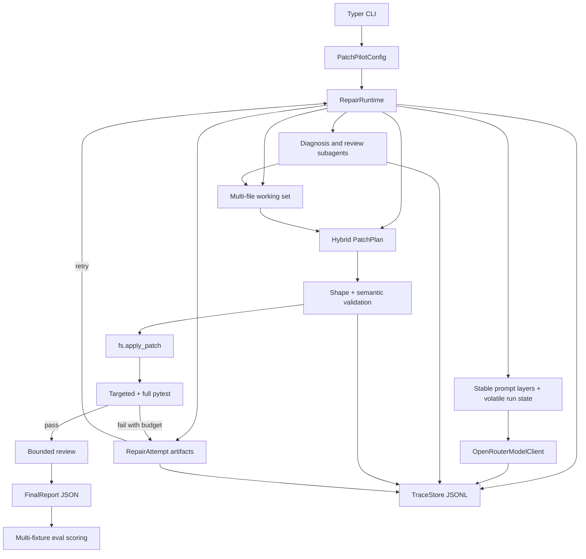

# PatchPilot V2 Multi-File Repair Plan

## Summary

PatchPilot v2 should extend the existing v1 repair runtime into a stronger multi-file Python/pytest repair agent. The work keeps the current model-provider, phase, trace, tool-registry, and subagent architecture, but adds explicit multi-file working sets, hybrid patch-plan validation, semantic changed-file checks, budgeted retry, a varied fixture suite, and eval/report proof for live OpenRouter repair power.

---

## Problem Frame

PatchPilot v1 already has the right skeleton for the X-ARC assignment: a phase-gated parent runtime, OpenRouter model calls, typed tool selection, scoped subagents, repository-bound filesystem tools, trace events, final reports, and smoke eval scoring. The current runtime is still shaped around one patch plan and one reported attempt. That is credible for a single-source demo, but it does not yet prove that PatchPilot can coordinate a repair across multiple source files, reject incoherent multi-file plans, or recover when the first validated patch fails tests.

The v2 requirements make repair power the bar. The product claim should stay narrow enough to be defensible: generalized multi-file Python/pytest source bugs in small controlled fixture repos, run through the real OpenRouter path, with fake/scripted behavior reserved for tests. The plan therefore strengthens the existing runtime in place instead of starting a new agent shell or broadening into other languages, PR automation, CI hosting, or environment repair.

---

## Requirements

**Multi-file repair capability**

- R1. PatchPilot can repair Python/pytest source bugs whose correct fix spans at least two source files, with every changed file reported and justified from evidence. Covers origin multi-file repair requirements.
- R2. The first v2 fixture suite contains at least ten varied multi-file Python/pytest fixture repos, including shared utility bugs, contract drift, and coordinated business behavior. Covers origin fixture-suite requirements.
- R3. The fixture suite includes genuinely nuanced bugs, not trivial two-file edits: each flagship fixture should require evidence gathering across source and tests, include at least one plausible distractor or partial-fix trap, and fail if only one side of a cross-file contract is repaired.
- R4. The live v2 eval reports aggregate pass rate, per-fixture result, trace ID, changed files, retry count, model metadata, cost metadata when available, and categorized failure reasons. Covers origin eval and reporting requirements.
- R5. The target v2 claim is at least 90% live pass rate across the multi-file suite when credentials, model access, and configured budgets are available. Covers origin proof-bar requirements.

**Model path and prompting**

- R6. The v2 repair-power path uses the strongest configured OpenRouter model selected at implementation time, while MiniMax remains an explicitly supported configurable model option. Covers origin model-path requirements.
- R7. Parent repair, diagnosis, patch planning, retry decisions, and review all use the same model-provider abstraction; fake model behavior remains offline test infrastructure only. Covers origin real-model and fake-test boundaries.
- R8. Prompt construction separates stable system/tool/schema/phase layers from volatile run state, and records provider cache metadata whenever OpenRouter returns it. Covers origin context and prompt caching requirements.

**Hybrid patch planning and semantic validation**

- R9. Patch plans include structured per-file edits plus one unified multi-file diff, and PatchPilot rejects plans where those two views disagree. Covers origin hybrid patch consistency requirements.
- R10. Patch validation rejects protected paths, repo escapes, undeclared changed files, oversized diffs, binary edits, and test edits for source-fix tasks. Covers origin write-safety requirements.
- R11. Patch validation checks that every changed file is evidence-linked and necessary for the same diagnosed root cause before write execution. Covers origin semantic validation requirements.
- R12. Rejected patch plans and validation reasons are preserved in traces and final reports. Covers origin semantic validation reporting requirements.

**Retry, context, and subagents**

- R13. Failed targeted or full pytest validation after an applied patch enters a budgeted retry loop that can gather new evidence and produce a revised patch. Covers origin retry requirements.
- R14. Each repair attempt preserves prior diagnosis, patch plan, applied diff, validation output, changed files, retry rationale, and final result. Covers origin attempt-reporting requirements.
- R15. Context compaction preserves typed artifacts losslessly while summarizing bulky command output, file reads, raw diffs, and repeated tool history into a phase-appropriate working set. Covers origin artifact-aware context requirements.
- R16. Diagnosis and review subagents operate in scoped child loops with fixed model/tool budgets, typed output schemas, no write tools, and trace-visible child activity. Covers origin subagent requirements.

**Submission and operational proof**

- R17. Individual run reports remain JSON-first and include status, root cause, attempts, changed files, tests run, subagents, semantic validation outcomes, trace ID, model metadata, usage/cost/cache summaries, and failure reason. Covers origin final report requirements.
- R18. Eval trace checks continue to verify 50+ tools, model-selected execution, subagent activity, typed patch planning, retries when present, validation, final reports, and coherent phase flow. Covers origin assignment-proof requirements.
- R19. README and memo updates explain the v2 scope, model configuration, fixture suite, eval commands, trace inspection path, public-repo hygiene, and known limits without claiming deterministic live success. Covers origin reviewer-facing requirements.

---

## Key Technical Decisions

- **Extend the v1 runtime rather than rewrite it:** The current phase lifecycle, registry/executor policy, trace store, model contract, and subagent hooks already match the assignment proof. V2 should add explicit multi-file state and validation behavior around those seams instead of replacing them.
- **Pin the model policy, not a stale model name:** The plan records that v2 should use the strongest configured OpenRouter model available during implementation, with MiniMax M3 still configurable. The exact default model ID should be verified when implemented because OpenRouter model availability can drift.
- **Make attempt state first-class:** Retry should not be a hidden loop around validation. Attempts should be explicit runtime artifacts that carry patch plan, diff, validation output, review output, changed files, and result into traces, compaction, eval scoring, and final reports.
- **Treat hybrid patch validation as the write gate:** The only source-fix write path should be evidence -> typed patch plan -> structured/diff consistency check -> semantic necessity check -> repo-bound patch application. This keeps multi-file repair power tied to auditable safety.
- **Keep review bounded and asymmetric:** Review should block or fail the run when it finds correctness, changed-file necessity, or regression-risk issues. Missing-validation concerns should be visible in reports and can produce failed or partial status, but review must not become an unbounded second repair loop.
- **Use fixture metadata as post-run diagnostics:** Each v2 fixture should declare bug shape, command, expected source-only files, expected behavior, and acceptable failure category. Product scoring should stay behavior-first, while eval output compares runtime artifacts to fixture metadata after completion to report whether the intended multi-file contract was actually proven.
- **Use hard fixtures, not checkbox fixtures:** The v2 suite should include cross-file contracts, stale re-exports, partial-fix traps, shared helper drift, and distracting nearby code so a one-file or superficial patch cannot count as a flagship success.
- **Separate live proof from offline contracts:** Unit and integration tests should use fake or mocked providers to verify contracts deterministically. Live eval remains opt-in through OpenRouter credentials and budgets, and it is the only path used for the v2 repair-power claim.
- **Make context packing artifact-aware instead of generic summarization:** Diagnosis, patch plans, validation results, attempts, changed files, review outputs, command history, and model metadata stay structured. Long stdout/stderr, file reads, and diffs can be summarized around the current working set.

---

## Planning Defaults From Origin Questions

- OQ1. **Default v2 model:** Resolve the exact strongest OpenRouter model ID during implementation and record it in config/docs/eval output. Keep MiniMax M3 selectable through the existing provider path.
- OQ2. **Fixture taxonomy:** Use ten-plus small Python/pytest fixtures grouped by shared utility bugs, contract drift, coordinated behavior changes, re-export drift, parser/validator mismatch, state transition mismatch, serialization/deserialization drift, and cross-module defaults.
- OQ3. **Budgets:** Start from existing runtime budget fields and make fixture-level eval budgets explicit in metadata. The implementation can tune concrete values after the first mocked and live dry runs.
- OQ4. **Review rejection:** Treat review correctness, changed-file necessity, and serious regression-risk failures as blocking. Surface missing-validation issues in final status and reports without allowing review to start an unbounded repair loop.
- OQ5. **Prompt caching portability:** Separate stable and volatile prompt layers, but only claim observed cache behavior when OpenRouter returns metadata.

---

## High-Level Technical Design

The parent runtime remains responsible for phase order, budgets, permissions, and termination. V2 adds a stronger data path through the existing loop: reproduce and diagnosis build a multi-file working set; patch planning produces a hybrid `PatchPlan`; validation checks both shape and semantics; write execution records an explicit attempt; validation failure feeds a compact retry context back into model decision-making while budgets remain. Subagents stay scoped child loops and contribute typed artifacts rather than free-form prose.

---

## Implementation Units

### Implementation Sequencing

1. Land model-profile and prompt-layer support first so later units use the same provider contract.
2. Add working-set and context artifacts before semantic patch validation, because semantic validation depends on explicit evidence links.
3. Add hybrid patch-plan validation before retry, because retries should preserve rejected or failed plans as typed attempt artifacts.
4. Add retry and attempt reporting before expanding the fixture suite, so fixture work can validate both single-attempt and multi-attempt runs.
5. Strengthen subagents alongside working-set and retry integration, then make eval scoring assert their trace-visible behavior.
6. Expand fixtures and eval aggregation after the runtime contracts are stable.
7. Update reports, tracing, README, and MEMO last so documentation reflects the implemented runtime and eval shape.

### U1. Model Profile, Prompt Layers, and Provider Metadata

- **Goal:** Make the v2 live model path configurable for the strongest OpenRouter model while keeping MiniMax M3 and fake providers available for the right purposes.
- **Files:** `patchpilot/config.py`, `patchpilot/cli.py`, `patchpilot/models/base.py`, `patchpilot/models/openrouter.py`, `patchpilot/runtime/graph.py`, `patchpilot/runtime/context.py`, `patchpilot/runtime/prompts.py`, `tests/test_model_clients.py`, `tests/test_cli.py`
- **Patterns to follow:** `PatchPilotConfig.from_env` already centralizes provider defaults and OpenRouter settings. `OpenRouterModelClient.select_tool` and `complete_json` already extract model metadata and cache fields.
- **Work:**
  - Add a named v2 model-profile concept that can resolve to the current strongest configured OpenRouter model without hardcoding v2 to MiniMax-only performance.
  - Preserve explicit MiniMax M3 selection through the existing model field and CLI/env overrides.
  - Preserve fake provider usage for tests, but keep product/eval docs and defaults oriented around OpenRouter.
  - Split prompt construction into stable layers and volatile run-state payloads so provider cache metadata can be interpreted consistently.
  - Ensure parent, patch-plan, retry, diagnosis, and review calls all record provider/model/usage/cache metadata when available.
- **Test scenarios:**
  - `tests/test_model_clients.py` verifies model-profile resolution, explicit MiniMax M3 override, missing-key behavior, metadata extraction, and prompt-cache metadata extraction using mocked HTTP responses.
  - `tests/test_cli.py` verifies CLI/env precedence for provider, model, model profile, prompt cache, and live-eval options without making network calls.
  - `tests/integration/test_fixture_repair.py` keeps fake/mocked model usage deterministic and clearly separated from live eval.
- **Requirement traceability:** R6, R7, R8, R17.

### U2. Multi-File Working Set and Artifact-Aware Context

- **Goal:** Give the parent and subagents a coherent multi-file view of the failing repo without flooding prompts with raw history.
- **Files:** `patchpilot/runtime/state.py`, `patchpilot/runtime/context.py`, `patchpilot/runtime/graph.py`, `patchpilot/adapters/python_pytest.py`, `patchpilot/tools/code.py`, `patchpilot/schemas/tool_io.py`, `tests/test_adapters.py`, `tests/test_runtime_context.py`, `tests/integration/test_fixture_repair.py`
- **Patterns to follow:** `compact_state` already preserves selected artifacts. `PythonPytestAdapter.source_candidates_for_test` already maps test imports to source candidates.
- **Work:**
  - Add a typed working-set artifact for relevant tests, implicated source files, evidence links, source/test mapping, unresolved unknowns, and summary snippets.
  - Expand failure parsing and test-to-source mapping for parametrized tests, stack traces, package re-exports, shared utilities, and multiple failing tests.
  - Preserve typed artifacts losslessly across compaction while summarizing bulky stdout/stderr, large file reads, raw diffs, and repeated tool output.
  - Feed current working set, prior attempts, validation state, and outstanding unknowns into phase-specific model prompts and subagent contexts.
- **Test scenarios:**
  - `tests/test_adapters.py` covers multi-failure pytest output, parametrized failures, import-driven source mapping, package re-export mapping, and shared utility candidate discovery.
  - `tests/test_runtime_context.py` verifies compaction keeps diagnosis, patch plans, validation results, attempts, changed files, review outputs, command history summaries, and model metadata as typed artifacts.
  - `tests/integration/test_fixture_repair.py` verifies a mocked multi-file run reads multiple source files before patch planning.
- **Requirement traceability:** R1, R11, R13, R14, R15, R16.

### U3. Hybrid PatchPlan Schema and Semantic Validation

- **Goal:** Make multi-file writes safe, coherent, and evidence-linked before `fs.apply_patch` can execute.
- **Files:** `patchpilot/schemas/tool_io.py`, `patchpilot/tools/code.py`, `patchpilot/tools/fs.py`, `patchpilot/tools/helpers.py`, `patchpilot/runtime/graph.py`, `patchpilot/schemas/reports.py`, `tests/test_fs_tools.py`, `tests/test_patch_planning.py`, `tests/test_repair_loop.py`
- **Patterns to follow:** `PatchPlan`, `PatchValidationInput`, `code.validate_patch_shape`, and `RepairRuntime._prepare_arguments` already form the write gate for v1.
- **Work:**
  - Extend `PatchPlan` so each structured edit has repository-relative path, source/test evidence references, edit purpose, expected validation, and root-cause linkage.
  - Add a consistency check that the structured edits and unified diff touch the same files and represent the same before/after intent.
  - Add semantic validation for evidence linkage, same-root-cause necessity, source-only tasks, protected paths, repo containment, binary files, undeclared files, and diff-size limits.
  - Preserve rejected patch plans and validation reasons as typed artifacts, trace events, and final-report entries.
  - Keep final changed-file reporting derived from applied patch and diff artifacts, with model prose used only as supporting rationale.
- **Test scenarios:**
  - `tests/test_patch_planning.py` rejects structured/diff file mismatches, missing evidence links, unrelated changed-file rationale, test edits for source-fix tasks, and undeclared changed files.
  - `tests/test_fs_tools.py` continues to prove repo-escape, protected-path, test-only, and diff-size guards.
  - `tests/test_repair_loop.py` verifies `fs.apply_patch` is unreachable until hybrid and semantic validation succeeds.
- **Requirement traceability:** R9, R10, R11, R12, R17.

### U4. Retry State Machine and Attempt Reporting

- **Goal:** Turn validation failure into a traceable budgeted retry behavior instead of a one-shot failure or blind reapplication.
- **Files:** `patchpilot/runtime/graph.py`, `patchpilot/runtime/state.py`, `patchpilot/runtime/context.py`, `patchpilot/schemas/reports.py`, `patchpilot/models/base.py`, `patchpilot/tools/exec_tools.py`, `tests/test_runtime_retry.py`, `tests/test_repair_loop.py`, `tests/integration/test_fixture_repair.py`
- **Patterns to follow:** `SessionState.attempt`, `validation_status`, `previous_patch_failures`, and `PatchPilotConfig.max_repair_attempts` already exist but need to become authoritative.
- **Work:**
  - Model attempts as typed runtime artifacts with patch plan, semantic validation result, apply result, targeted test result, full test result, diff summary, review output, status, and failure category.
  - On targeted or full pytest failure after an applied patch, record the attempt, update working set context, and route to retry decision while budgets remain.
  - Allow retry to gather additional evidence before requesting a revised patch plan.
  - Stop retry on success, unsafe/incoherent patch, model/tool/write budget exhaustion, or review rejection.
  - Report success, partial, failed, or budget-exhausted termination consistently across final JSON and eval output.
- **Test scenarios:**
  - `tests/test_runtime_retry.py` verifies a first failing patch records attempt one, requests a revised patch, and succeeds on attempt two with both attempts in the report.
  - `tests/test_runtime_retry.py` verifies retry stops at `max_repair_attempts` and reports budget exhaustion with categorized failure.
  - `tests/test_repair_loop.py` verifies failed full pytest after passing targeted pytest still creates a retry-eligible attempt.
  - `tests/integration/test_fixture_repair.py` covers a mocked retry fixture that fails on the first patch and passes after revised evidence.
- **Requirement traceability:** R4, R12, R13, R14, R17, R18.

### U5. Diagnosis and Review Subagents for Multi-File Repair

- **Goal:** Strengthen subagents so diagnosis and review can reason across multiple files while staying bounded and non-writing.
- **Files:** `patchpilot/runtime/subagents.py`, `patchpilot/tools/subagent.py`, `patchpilot/tools/registry.py`, `patchpilot/schemas/tool_io.py`, `patchpilot/schemas/reports.py`, `tests/test_subagent_tools.py`, `tests/test_runtime_subagents.py`, `tests/integration/test_fixture_repair.py`
- **Patterns to follow:** `SubagentRuntime`, `SUBAGENT_CONFIGS`, `DiagnosisResult`, and `ReviewResult` already provide typed child-loop scaffolding.
- **Work:**
  - Expand diagnosis allowed tools to inspect multiple relevant files, source/test mappings, and compact working-set artifacts while still denying write tools.
  - Return implicated files, evidence links, shared root cause, confidence, risk notes, and recommended repair direction in typed diagnosis output.
  - Expand review to inspect diff, patch plan, attempts, validation results, changed-file necessity, and regression risk within fixed budgets.
  - Make review output participate in termination status when it rejects correctness, necessity, or serious regression-risk issues.
  - Trace subagent model calls, tool calls, structured outputs, budget exhaustion, and rejected unauthorized tool selections.
- **Test scenarios:**
  - `tests/test_subagent_tools.py` verifies diagnosis and review subagents cannot use write tools and return typed outputs.
  - `tests/test_runtime_subagents.py` verifies child traces include model/tool events and budget exhaustion records structured failure.
  - `tests/integration/test_fixture_repair.py` verifies parent patch planning consumes diagnosis implicated files without string parsing.
- **Requirement traceability:** R7, R11, R15, R16, R17, R18.

### U6. Ten-Plus Multi-File Fixture Suite

- **Goal:** Build a varied but controlled Python/pytest suite that proves generalized multi-file source repair rather than one hand-picked demo.
- **Files:** `fixtures/`, `patchpilot/evals/suites.py`, `patchpilot/evals/harness.py`, `patchpilot/adapters/python_pytest.py`, `tests/test_adapters.py`, `tests/test_eval_harness.py`, `tests/integration/test_multifile_eval.py`
- **Patterns to follow:** Existing fixtures use `fixture.json`, `pyproject.toml`, source package files, and pytest tests. Existing adapter tests already assert fixtures fail before repair.
- **Work:**
  - Add fixture metadata fields for bug shape, goal, test command, expected changed source files, allowed changed files, expected validation commands, and expected failure category.
  - Expand from current single-file-heavy examples to at least ten multi-file fixtures.
  - Include shared utility bugs, contract drift, coordinated business behavior, public API re-export drift, parser/validator mismatch, state transition mismatch, serialization/deserialization drift, cross-module constant/default mismatch, and at least two retry-oriented partial-fix traps.
  - Give flagship fixtures plausible distractors, such as adjacent tests that mention the same symbols, source modules with similar helper names, or one-file fixes that pass targeted tests but fail full pytest.
  - Require fixture tests to directly exercise every expected source file so one-file partial repairs fail behaviorally. Fixture metadata marks the intended multi-file contract and eval reports a post-run mismatch when changed files do not prove that contract.
  - Keep fixtures small enough that live eval is affordable and trace review remains readable.
  - Add pre-repair failing checks and expected-patch oracle helpers for deterministic test coverage without requiring live model success.
- **Test scenarios:**
  - `tests/test_adapters.py` verifies every new fixture fails before repair and has discoverable Python/pytest commands.
  - `tests/test_multifile_fixtures.py` verifies fixture metadata expected files are source-only, every expected file has direct behavioral tests, known one-file partial repairs fail pytest, and known full multi-file repairs pass.
  - `tests/test_eval_harness.py` verifies fixture metadata validates, product success is behavior-first, and changed-file contract mismatches are reported as diagnostics instead of product failure categories.
  - `tests/integration/test_multifile_eval.py` uses mocked model scripts to prove the suite runner can copy fixtures, run repairs, and aggregate results.
- **Requirement traceability:** R1, R2, R3, R4, R5.

### U7. Multi-Fixture Live Eval and Failure Categorization

- **Goal:** Make the v2 proof auditable across the full fixture suite with trace-derived scoring and clear failure categories.
- **Files:** `patchpilot/evals/suites.py`, `patchpilot/evals/harness.py`, `patchpilot/evals/checks.py`, `patchpilot/cli.py`, `patchpilot/schemas/reports.py`, `tests/test_eval_harness.py`, `tests/integration/test_smoke_eval.py`, `tests/integration/test_multifile_eval.py`
- **Patterns to follow:** `run_smoke_eval`, `score_trace`, and `trace_tool_checks` already score traces for assignment proof.
- **Work:**
  - Add a v2 suite entrypoint that iterates fixture metadata, copies each fixture into disposable workspaces, runs live OpenRouter repair, and aggregates per-fixture output.
  - Score product success from pytest results, source-only edits, semantic validation visibility, review outcome, retry visibility when used, and final report completeness. Report changed-file expectations separately as `multi_file_contract` diagnostics.
  - Categorize failures as model output invalid, unsafe patch, patch did not apply, targeted tests failed, full tests failed, budget exhausted, review rejected, missing API key, provider failure, or fixture setup failure.
  - Include model used, provider, trace ID, report path, model calls, tool calls, retry count, changed files, usage/cost/cache metadata, and failure reason in eval JSON.
  - Keep paid live runs gated by credentials and explicit live-eval posture while mocked tests verify contracts offline.
- **Test scenarios:**
  - `tests/test_eval_harness.py` verifies aggregate pass-rate math, failure categorization, model metadata propagation, and missing-key behavior without network calls.
  - `tests/integration/test_multifile_eval.py` verifies the suite runner handles multiple copied fixtures and produces stable JSON output with mocked models.
  - `tests/integration/test_smoke_eval.py` remains the small smoke path and does not become the v2 proof by itself.
- **Requirement traceability:** R4, R5, R7, R13, R14, R18.

### U8. Final Reports, Tracing, and Reviewer Documentation

- **Goal:** Make individual runs and the v2 suite understandable to a reviewer without private runtime state.
- **Files:** `patchpilot/observability/tracing.py`, `patchpilot/schemas/reports.py`, `patchpilot/errors.py`, `patchpilot/runtime/graph.py`, `README.md`, `MEMO.md`, `tests/test_eval_harness.py`, `tests/test_runtime_retry.py`, `tests/test_trace_store.py`
- **Patterns to follow:** `TraceStore`, `TraceEvent`, `FinalReport`, and existing README/MEMO assignment framing already establish the artifact path.
- **Work:**
  - Extend final reports with attempts, semantic validation outcomes, rejected plans, review result, retry summary, failure category, model usage/cost/cache summary, and trace/report file references.
  - Ensure traces record model calls, prompt-layer/cache metadata, patch-plan creation, patch-plan rejection, semantic validation, attempts, retry decisions, subagent child loops, review decisions, and final report.
  - Redact API keys and sensitive env-like values from traces and reports.
  - Update README for v2 setup, model configuration, fake-vs-live distinction, fixture-suite commands, trace inspection, and public-repo hygiene.
  - Update MEMO with what v2 proves, what remains cut, how to inspect traces, and one defended design decision.
- **Test scenarios:**
  - `tests/test_trace_store.py` verifies sanitized failed and successful trace events remain JSON-serializable.
  - `tests/test_runtime_retry.py` verifies reports include every attempt, semantic validation result, retry reason, and failure category.
  - `tests/test_eval_harness.py` verifies eval output includes report and trace identifiers for each fixture.
  - Documentation checks in tests or review verify README/MEMO commands point to real CLI paths and do not mention nonexistent commands.
- **Requirement traceability:** R4, R12, R14, R17, R18, R19.

---

## Acceptance Examples

- AE1. **Multi-file success:** Given a fixture where parser and validator modules drift from the same data contract, when PatchPilot runs with OpenRouter, write permission, and exec permission, then it produces a source-only patch across both modules, passes targeted and full pytest, reports both changed files, and records the shared root cause.
- AE2. **Semantic rejection:** Given a model patch that changes one relevant source file and one unrelated source file, when PatchPilot validates the patch plan, then it rejects or retries the plan because every changed file is not necessary for the same root cause.
- AE3. **Hybrid consistency rejection:** Given a patch plan whose structured edits name one file but the unified diff changes another, when validation runs, then the plan is rejected before `fs.apply_patch`.
- AE4. **Retry success:** Given a first multi-file patch that applies but fails targeted pytest, when repair budgets remain, then PatchPilot records the failed attempt, compacts retry context, gathers or uses additional evidence, produces a revised patch, and reports the later passing attempt.
- AE5. **Artifact-aware compaction:** Given a long multi-file run with repeated file reads and test output, when context compaction occurs, then typed diagnosis, patch plan, validation results, attempts, changed files, review output, command history summary, and model metadata remain available to later phases.
- AE6. **Bounded review:** Given a passing patch, when review runs, then the review subagent checks correctness, changed-file necessity, missing validation, and regression risk within fixed budgets and returns structured output that affects final status.
- AE7. **Suite proof:** Given the v2 live eval suite and configured OpenRouter credentials, when it completes, then aggregate JSON reports at least 90% pass rate or categorizes every failure with trace IDs, model metadata, retry counts, changed files, and failure categories.

---

## Origin Traceability

| Origin item | Plan coverage |
|---|---|
| F1. Generalized multi-file repair | R1, R3, R9, R11, U2, U3, U5, U6, AE1 |
| F2. Validation-failure retry | R13, R14, U4, U7, AE4 |
| F3. Semantic patch validation | R9, R10, R11, R12, U3, AE2, AE3 |
| F4. Artifact-aware context update | R8, R15, U2, U4, AE5 |
| F5. Multi-fixture live eval | R2, R3, R4, R5, R18, U6, U7, AE7 |
| AE1. Multi-file success | R1, R17, U2, U3, U5, U6 |
| AE2. Semantic validation | R11, R12, U3 |
| AE3. Retry success | R13, R14, U4 |
| AE4. Hybrid patch consistency | R9, U3 |
| AE5. Artifact-aware context | R15, U2 |
| AE6. Bounded review | R16, U5 |
| AE7. Suite proof | R2, R3, R4, R5, U6, U7 |

---

## Scope Boundaries

### In Scope For V2

- Multi-file Python/pytest source repair in small controlled fixture repos.
- Real OpenRouter model path for the v2 repair-power claim.
- MiniMax M3 as a configurable supported model option.
- Fake and mocked model clients for deterministic offline tests.
- Hybrid structured-plus-diff patch plans.
- Semantic changed-file validation.
- Budgeted retry after patch validation failure or pytest failure.
- Artifact-aware context packing for parent and subagents.
- Diagnosis and review subagents with scoped tools and fixed budgets.
- Ten-plus varied multi-file fixtures.
- JSON reports, JSONL traces, eval JSON, README, and MEMO updates.

### Deferred To Follow-Up Work

- Non-Python repo support.
- Arbitrary monorepo repair claims.
- GitHub PR creation.
- Hosted CI integration.
- Autonomous dependency installation or environment repair beyond the configured test command path.
- Multi-model benchmark productization beyond a configurable OpenRouter route.

### Outside This Product Identity

- A general-purpose coding assistant.
- A guaranteed deterministic live-model repair claim.
- A demo that edits tests to hide source bugs.
- A hardcoded fixture-only script that bypasses model-selected tools, subagents, patch validation, traces, or reports.

---

## System-Wide Impact

This work is cross-cutting. The runtime state model, context packing, patch-plan schema, validation tools, subagent runtime, eval harness, final report schema, CLI configuration, fixtures, tests, README, and MEMO all change. The core invariant is that reviewer-facing claims must be visible in artifacts: trace events, final report JSON, eval output, fixture metadata, or documentation. If the live model succeeds but the trace cannot prove how, v2 has not met the assignment bar.

The riskiest shared contract is the patch-plan path. `PatchPlan`, validation outputs, attempt artifacts, final reports, and eval checks should evolve together so the model contract, runtime behavior, and proof artifacts do not drift.

---

## Risks And Dependencies

| Risk or dependency | Impact | Mitigation |
|---|---|---|
| OpenRouter model availability changes | A pinned default model may become stale or unavailable | Resolve the strongest v2 default at implementation time, keep explicit model override, and document the actual model used in eval output |
| Live model runs are nondeterministic | The suite may miss the 90% target on a bad run | Keep offline contract tests deterministic, keep fixtures small, expose failure categories, and report actual pass rate rather than hiding failures |
| Multi-file validation becomes over-strict | Correct patches may be rejected before tests can prove them | Start with evidence-link and same-root-cause checks that are explainable and trace rejected reasons for review |
| Retry can amplify cost and flakiness | Failed repairs may spend too much budget | Enforce per-fixture model/tool/retry/cost budgets and report budget exhaustion as a first-class category |
| Review blocks useful patches too aggressively | Passing repairs may fail due to review uncertainty | Make correctness, necessity, and serious regression-risk failures blocking; surface missing-validation concerns without entering an unbounded review loop |
| Fixture suite overfits to expected model behavior | V2 claim becomes another scripted demo | Use varied bug shapes, metadata-based scoring, real OpenRouter eval, and trace checks for model-selected tools and subagent activity |
| Prompt caching metadata varies by route | Cache claims may be misleading | Record returned cache metadata when present and describe caching as observed provider behavior, not guaranteed savings |
| Report schema changes break existing tests | V1 tests may fail from shape drift | Add compatibility-minded fields where possible and update tests around typed attempt/report contracts deliberately |

---

## Sources And Research

- `docs/brainstorms/2026-06-05-patchpilot-v2-multifile-repair-requirements.md` is the origin document for v2 scope, requirements, flows, acceptance examples, non-goals, and planning defaults.
- `docs/plans/2026-06-04-001-feat-patchpilot-v1-real-model-repair-plan.md` documents the v1 real-model repair direction that v2 extends.
- `patchpilot/runtime/graph.py` contains the current phase-gated parent repair loop, scaffolded phase continuation, patch-plan creation, validation gate, and final-report assembly.
- `patchpilot/runtime/state.py` and `patchpilot/runtime/context.py` contain the current state and compaction seams that should become attempt-aware and artifact-aware.
- `patchpilot/schemas/tool_io.py` contains current `PatchPlan`, patch validation, subagent, and tool I/O schemas.
- `patchpilot/tools/code.py` and `patchpilot/tools/fs.py` contain the current patch validation and repository-bound patch application tools.
- `patchpilot/runtime/subagents.py` contains current scoped diagnosis and review subagent loops.
- `patchpilot/models/openrouter.py` and `patchpilot/models/base.py` contain current OpenRouter structured-output and metadata contracts.
- `patchpilot/evals/harness.py`, `patchpilot/evals/suites.py`, and `patchpilot/evals/checks.py` contain the current smoke eval and trace scoring path.
- `fixtures/` and `tests/` contain the current single-file and small fixture/test patterns that the v2 suite should extend.
